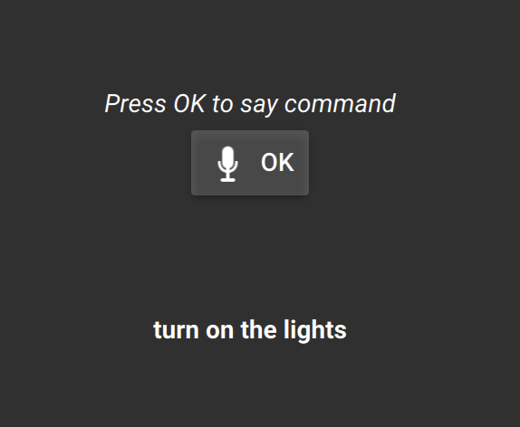

# Qt Voice Assistant
Qt/Qml application using Google speech-to-text API to make voice commands - [see linked
article](https://medium.com/@petar.koretic/making-your-own-assistant-with-qt-qml-and-google-speech-to-text-6ade0a01f731)

